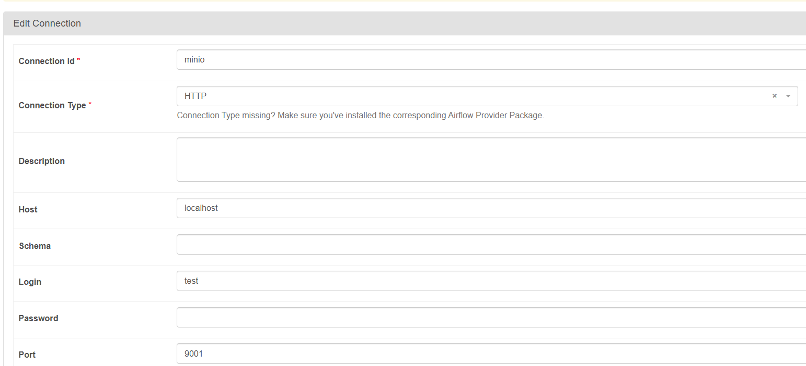

# integracao-dados-ifpb

Repositório destinado ao projeto que investiga a correlação entre dados de qualidade do ar do AQICN e do MapBiomas para estudo de caso na disciplina de Integração de Dados do Mestrado PPGTI - IFPB

## Ferramentas utilizadas:

- VS Code: IDE utilizada para utilizado para executar de forma rápida os códigos e funções em python. Toda limpeza e tratamento inicial dos dados foi realizado nessa ferramenta que permitiu uma rápida visualização dos dataframes criados. Além disto foi utilizada para integrar o código criado em python com a ferramenta airflow através do uso de DAGs (Directed Acyclic Graph).
- Apache Airflow: Orquestrador de pipelines que possibilitou o gerenciamento e a automatização do fluxo de tarefas criado.
- Docker: Ferramenta gerenciadora de containers que permitiu a criação de um ambiente escalável onde o airflow foi executado.
- MiniIO: No contexto do projeto, o MinIO foi integrado ao fluxo de trabalho para permitir o armazenamento de arquivos e dados processados de maneira escalável e acessível, facilitando o gerenciamento e a recuperação de informações durante as tarefas do Airflow.

## Desenho do fluxo da DAG no airflow:

## Como reproduzir esse projeto

- Faça gitclone do projeto: git clone https://github.com/marinamaracaja/integracao-dados-ifpb.git
- Abra o Docker Desktop
- Abra a pasta na sua máquina que contenha o repositório "integracao-dados-ifpb"
- Abra o terminal de comando nesse repositório
- Comando para subir pela primeira vez o airflow: docker-compose up --build
- Uma vez criado das próximas vezes só precisa do comando: docker-compose up -d
- Acessar: http://localhost:8080/home
- Criar connections no airflow "minio" e "mapbiomas_login":
  
  

- Ligar dag "dag_qualidade_ar"
- Acompanhar logs de execução

## Estrutura do datalake:

Camadas de dados criadas como buckets no MinIO:

1. **Raw (Camada Bruta)**:

   - Armazena os dados no formato original, sem qualquer tipo de transformação.
   - Pode conter dados estruturados, semiestruturados e não estruturados.
   - O objetivo é preservar os dados em sua forma mais pura para referência futura ou caso uma nova abordagem de processamento seja necessária.
   - Formatos comuns: JSON, CSV, Parquet, ORC, entre outros.

2. **Staging (Camada de Preparação)**:

   - Utilizada para pré-processamento dos dados antes de serem movidos para a camada **Trusted**.
   - Nesta fase, podem ser realizadas transformações intermediárias, limpeza e filtragem de dados.
   - Muitas vezes, os dados nesta camada são temporários e usados apenas como uma etapa intermediária no pipeline ETL/ELT.

3. **Trusted (Camada Confiável)**:

   - Armazena dados que já passaram por processos de validação, transformação e padronização.
   - Os dados nesta camada são considerados de alta qualidade e prontos para consumo por diversas áreas da organização.
   - Organizados de forma a facilitar consultas e análises, por exemplo, com estruturas de tabela otimizadas e modelagem de dados.

4. **Application (Camada de Aplicação ou Apresentação)**:
   - Focada no consumo final dos dados por aplicações, relatórios ou análises avançadas.
   - Pode conter agregações, sumarizações e dados transformados para atender necessidades específicas dos usuários ou sistemas.
   - Também pode ser chamada de **Camada de Serviço** ou **Camada de Apresentação**.

Exemplo de arquivo json salvo na camada RAW:

### Fluxo de Dados

- Os dados são inicialmente armazenados na **Raw**, depois passam por transformações na **Staging**, onde são limpos e estruturados.
- Em seguida, os dados são movidos para a **Trusted**, onde ficam disponíveis para análises mais profundas ou cruzamentos.
- Finalmente, os dados podem ser carregados na **Application**, que apresenta os dados prontos para consumo em dashboards, APIs, ou sistemas de machine learning.

Essa arquitetura garante um ciclo controlado de evolução dos dados, desde a ingestão até o consumo final, promovendo governança, escalabilidade e flexibilidade no uso de dados.

### Integrantes

- Fabiana Macêdo
- Felipe Targino
- Marina Maracajá
- Wallennon Germano
